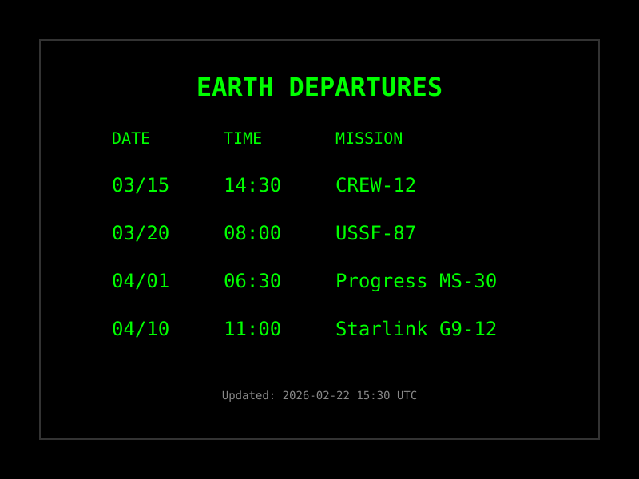

# Spacecraft Launches Plugin

Track upcoming spacecraft launch countdowns and statuses using the Launch Library 2 API.

**→ [Setup Guide](./docs/SETUP.md)** - Configuration and usage instructions



## Overview

The Spacecraft Launches plugin fetches upcoming launch data from the [Launch Library 2 API](https://ll.thespacedevs.com/docs/) by The Space Devs and displays launch name, countdown, status, pad, and provider information. Inspired by airport departure boards, it presents space launches as "Earth Departures."

## Architecture

### Plugin Class

`SpacecraftLaunchesPlugin` extends `PluginBase` and implements:

- **Launch Data Fetching**: Queries the LL2 API for upcoming launches
- **Countdown Computation**: Real-time countdown to each launch NET
- **Launch Parsing**: Extracts name, status, pad, provider, rocket, and mission data
- **Caching**: Implements cache with TTL based on refresh interval
- **Error Handling**: Graceful handling of rate limits, missing data, API failures

### Data Flow

```
1. Configuration
   ├─ Max launches (1-10)
   └─ Refresh interval (min 240 seconds)

2. API Request
   ├─ Query LL2 /launches/upcoming/ endpoint
   └─ Request detailed mode for full launch data

3. Data Processing
   ├─ Parse launch objects
   ├─ Extract mission, rocket, pad, provider info
   ├─ Compute countdowns from NET datetime
   └─ Format display strings

4. Output
   ├─ Primary launch (next upcoming)
   ├─ Array of all launches
   └─ Formatted display lines
```

## API Integration

### Launch Library 2 API

**Base URL**: `https://ll.thespacedevs.com/2.3.0`

**Endpoint:**
- Upcoming Launches: `GET /launches/upcoming/?limit=N&mode=detailed`

**Authentication:**
- No authentication required
- Free tier supports up to 15 requests per hour

**Rate Limits:**
- 15 requests per hour (unauthenticated)
- Plugin default refresh interval: 300 seconds (12 req/hr, within limit)
- Minimum refresh interval: 240 seconds

### Launch Object Structure

The API returns launch objects with these key fields:

```python
{
    "id": "uuid",
    "name": "Falcon 9 Block 5 | Crew-12",
    "status": {
        "id": 1,
        "name": "Go for Launch",
        "abbrev": "Go",
        "description": "..."
    },
    "net": "2026-03-15T14:30:00Z",        # No Earlier Than
    "window_start": "2026-03-15T14:30:00Z",
    "window_end": "2026-03-15T18:30:00Z",
    "pad": {
        "name": "Space Launch Complex 40",
        "location": {"name": "Cape Canaveral, FL, USA"}
    },
    "launch_service_provider": {
        "name": "SpaceX",
        "type": "Commercial"
    },
    "rocket": {
        "configuration": {
            "name": "Falcon 9",
            "full_name": "Falcon 9 Block 5"
        }
    },
    "mission": {
        "name": "Crew-12",
        "description": "...",
        "type": "Human Spaceflight"
    }
}
```

## Implementation Details

### Countdown Computation

Countdowns are computed in real-time from the launch NET datetime:

```python
def _compute_countdown(net_str):
    net_dt = datetime.fromisoformat(net_str)
    delta = net_dt - datetime.now(timezone.utc)

    if delta.total_seconds() <= 0:
        return "LAUNCHED"

    days = total_seconds // 86400
    hours = (total_seconds % 86400) // 3600
    minutes = (total_seconds % 3600) // 60
    seconds = total_seconds % 60

    if days > 0:
        return f"{days}d {hours:02d}:{minutes:02d}:{seconds:02d}"
    else:
        return f"{hours:02d}:{minutes:02d}:{seconds:02d}"
```

### Mission & Rocket Name Extraction

The plugin extracts mission and rocket names from dedicated API fields, with fallback to parsing the launch name:

```python
# Launch names follow the pattern: "Rocket | Mission"
# e.g., "Falcon 9 Block 5 | Crew-12"
if " | " in name:
    rocket = name.split(" | ")[0].strip()
    mission = name.split(" | ", 1)[1].strip()
```

### Display Formatting

The plugin formats launches similar to an airport departure board:

**Example Display:**
```
   EARTH DEPARTURES
DATE TIME MISSION
03/15 14:30 CREW-12
03/20 08:00 USSF-87
04/01 06:30 Progress MS-30
```

## Error Handling

### Rate Limiting

- Detects 429 status code
- Returns cached data if available
- Default refresh respects 15 req/hr limit
- Minimum refresh interval enforced at 240 seconds

### Missing Data

- Handles null/missing mission, rocket, pad, and provider fields
- Falls back to launch name parsing for mission/rocket
- Displays "Unknown" for missing required fields

### API Failures

- Catches network exceptions
- Returns cached data when available
- Logs errors for debugging
- Returns user-friendly error messages

### Caching

- Caches successful API responses
- TTL based on `refresh_seconds` setting
- Returns cached data on errors
- Invalidated on cleanup

## Configuration

### Optional Settings

- `max_launches`: Maximum launches to display (default: 4, max: 10)
- `refresh_seconds`: Update interval (default: 300, min: 240)

### Validation

- Max launches: 1 to 10
- Refresh: >= 240 seconds

## Template Variables

### Simple Variables

- `name`: Next launch full name
- `status`: Next launch status (e.g., "Go for Launch")
- `net`: Next launch NET datetime (ISO 8601)
- `countdown`: Next launch countdown (e.g., "2d 05:30:00")
- `pad`: Next launch pad name
- `provider`: Next launch service provider
- `rocket`: Next launch rocket name
- `mission`: Next launch mission name
- `formatted`: Pre-formatted display line
- `headers`: Column headers ("DATE TIME MISSION")
- `launch_count`: Number of launches
- `last_updated`: ISO timestamp of last update

### Array Variables

- `launches`: Array of upcoming launches (sorted by NET)
  - `name`: Full launch name
  - `status`: Status name
  - `status_abbrev`: Status abbreviation
  - `net`: NET datetime (ISO 8601)
  - `net_date`: Date (MM/DD)
  - `net_time`: Time (HH:MM UTC)
  - `countdown`: Countdown string
  - `pad`: Launch pad name
  - `pad_location`: Pad location
  - `provider`: Launch service provider
  - `rocket`: Rocket name
  - `mission`: Mission name
  - `formatted`: Pre-formatted display line

## Usage Examples

### Default Format (Earth Departures Board)

```
{center}EARTH DEPARTURES
{{spacecraft_launches.headers}}
{{spacecraft_launches.launches.0.formatted}}
{{spacecraft_launches.launches.1.formatted}}
{{spacecraft_launches.launches.2.formatted}}
{{spacecraft_launches.launches.3.formatted}}
```

### With Countdown

```
{center}NEXT LAUNCH
{{spacecraft_launches.mission}}
T- {{spacecraft_launches.countdown}}
{{spacecraft_launches.rocket}}
PAD: {{spacecraft_launches.pad}}
STATUS: {{spacecraft_launches.status}}
```

### Individual Launch Fields

```
{{spacecraft_launches.launches.0.mission}}
{{spacecraft_launches.launches.0.countdown}}
{{spacecraft_launches.launches.0.provider}}
```

## Testing

### Unit Tests

Located in `tests/test_plugin.py`:

- Plugin initialization
- Configuration validation
- Countdown computation
- Launch parsing (with/without mission data, null fields)
- Display formatting
- Data fetching (success, empty, rate limit, errors)
- Caching behavior
- Variables match manifest

### Coverage

Current: >80% code coverage (meets target)

## Dependencies

- `requests`: HTTP client for API calls
- `datetime`: Standard library for timestamps and countdowns

## Performance Considerations

### API Rate Limits

- Default refresh: 300 seconds (12 requests/hour, within 15/hr limit)
- Minimum refresh: 240 seconds (enforced)
- Caching reduces actual API calls
- Rate limit responses return cached data

### Memory

- Caches single response (small footprint)
- Limits launch array to max_launches (default: 4)

## References

- [Launch Library 2 API Documentation](https://ll.thespacedevs.com/docs/)
- [The Space Devs](https://thespacedevs.com/)
- [Plugin Development Guide](../../docs-site/docs/development/plugin-guide.md)
