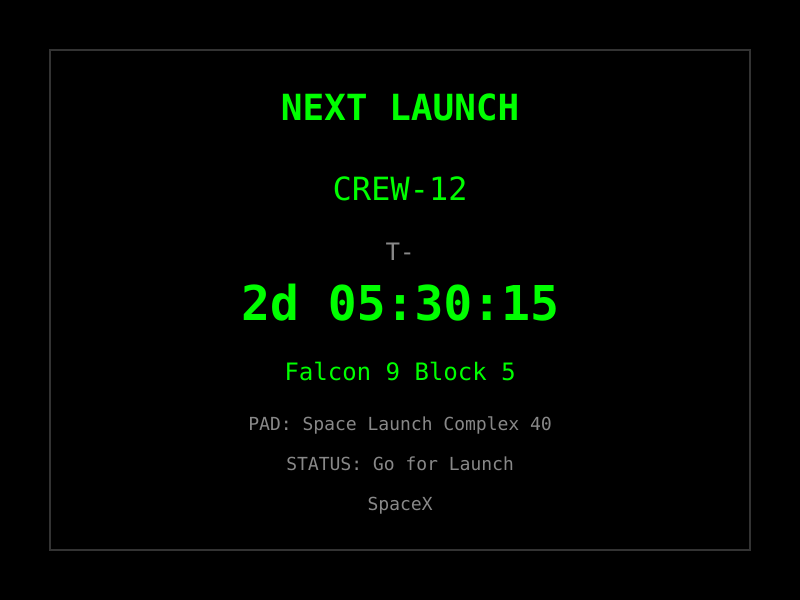

# Spacecraft Launches Setup Guide

The Spacecraft Launches plugin displays upcoming rocket launch countdowns and statuses, inspired by airport departure boards. Track launches from SpaceX, NASA, Roscosmos, and more — no API key required.

## Plugin Display Examples

### Earth Departures Board


### Next Launch Countdown



### Configuration Interface


## Overview

**What it does:**
- Displays up to 10 upcoming spacecraft launches
- Shows launch date, time, mission name, status, and countdown
- Updates automatically based on your refresh interval
- No API key required — uses the free Launch Library 2 API

**Use Cases:**
- Track upcoming SpaceX, NASA, and other launches
- Display an "Earth Departures" board for space enthusiasts
- Countdown timer to the next rocket launch
- Monitor launch statuses (Go, TBD, Hold, etc.)

## Prerequisites

- ✅ Internet connection for API access
- ✅ No API key required (free public API)

## Quick Setup

### 1. Enable Spacecraft Launches

Via Web UI (Recommended):
1. Go to **Integrations** and find **Spacecraft Launches**
2. Toggle to **Enable**
3. Click **Configure** to adjust settings (optional)
4. Click **Save**

Via Environment Variables:
```bash
# Add to .env
SPACECRAFT_LAUNCHES_ENABLED=true
SPACECRAFT_LAUNCHES_MAX_COUNT=4
SPACECRAFT_LAUNCHES_REFRESH_SECONDS=300
```

### 2. Use in Templates

Available variables:
- `{{spacecraft_launches.mission}}` - Next launch mission name
- `{{spacecraft_launches.countdown}}` - Countdown to next launch
- `{{spacecraft_launches.status}}` - Launch status
- `{{spacecraft_launches.rocket}}` - Rocket name
- `{{spacecraft_launches.provider}}` - Launch provider

## Configuration Reference

| Setting | Type | Default | Description |
|---------|------|---------|-------------|
| enabled | boolean | false | Enable/disable the plugin |
| max_launches | integer | 4 | Maximum launches to display (1-10) |
| refresh_seconds | integer | 300 | Update interval (minimum 240 seconds) |

### Environment Variables

```bash
SPACECRAFT_LAUNCHES_ENABLED=true
SPACECRAFT_LAUNCHES_MAX_COUNT=4           # Default: 4 launches
SPACECRAFT_LAUNCHES_REFRESH_SECONDS=300   # Default: 300 seconds (5 min)
```

## Template Variables

### Next Launch (Primary)

```
{{spacecraft_launches.name}}           # Full launch name (e.g., "Falcon 9 | Crew-12")
{{spacecraft_launches.mission}}        # Mission name (e.g., "Crew-12")
{{spacecraft_launches.rocket}}         # Rocket name (e.g., "Falcon 9")
{{spacecraft_launches.provider}}       # Provider (e.g., "SpaceX")
{{spacecraft_launches.status}}         # Status (e.g., "Go for Launch")
{{spacecraft_launches.countdown}}      # Countdown (e.g., "2d 05:30:00")
{{spacecraft_launches.net}}            # NET datetime (ISO 8601)
{{spacecraft_launches.pad}}            # Launch pad name
{{spacecraft_launches.formatted}}      # Pre-formatted line
{{spacecraft_launches.launch_count}}   # Number of launches
```

### Individual Launches (Array)

```
{{spacecraft_launches.launches.0.mission}}      # First launch mission
{{spacecraft_launches.launches.0.countdown}}    # First launch countdown
{{spacecraft_launches.launches.0.status}}       # First launch status
{{spacecraft_launches.launches.0.net_date}}     # Date (MM/DD)
{{spacecraft_launches.launches.0.net_time}}     # Time (HH:MM UTC)
{{spacecraft_launches.launches.0.rocket}}       # Rocket name
{{spacecraft_launches.launches.0.provider}}     # Provider name
{{spacecraft_launches.launches.0.pad}}          # Pad name
{{spacecraft_launches.launches.0.pad_location}} # Pad location
{{spacecraft_launches.launches.0.formatted}}    # Formatted line

{{spacecraft_launches.launches.1.mission}}      # Second launch
{{spacecraft_launches.launches.2.mission}}      # Third launch
```

## Example Templates

### Earth Departures Board

**Template:**
```
{center}EARTH DEPARTURES
{{spacecraft_launches.headers}}
{{spacecraft_launches.launches.0.formatted}}
{{spacecraft_launches.launches.1.formatted}}
{{spacecraft_launches.launches.2.formatted}}
{{spacecraft_launches.launches.3.formatted}}
```

**Display:**


Output example:
```
   EARTH DEPARTURES
DATE TIME MISSION
03/15 14:30 CREW-12
03/20 08:00 USSF-87
04/01 06:30 Progress MS-30
04/10 11:00 Starlink G9-12
```

### Next Launch Countdown

**Template:**
```
{center}NEXT LAUNCH
{{spacecraft_launches.mission}}
T- {{spacecraft_launches.countdown}}
{{spacecraft_launches.rocket}}
PAD: {{spacecraft_launches.pad}}
STATUS: {{spacecraft_launches.status}}
```

**Display:**


### Compact View

```
{center}LAUNCHES
{{spacecraft_launches.launches.0.mission}} {{spacecraft_launches.launches.0.countdown}}
{{spacecraft_launches.launches.1.mission}} {{spacecraft_launches.launches.1.countdown}}
{{spacecraft_launches.launches.2.mission}} {{spacecraft_launches.launches.2.countdown}}
```

### Detailed View

```
{center}SPACE LAUNCHES
{{spacecraft_launches.launches.0.rocket}}
{{spacecraft_launches.launches.0.mission}}
{{spacecraft_launches.launches.0.provider}}
STATUS: {{spacecraft_launches.launches.0.status}}
T- {{spacecraft_launches.launches.0.countdown}}
```

## Refresh Interval Guidelines

The Launch Library 2 API allows 15 requests per hour (free tier). Choose your refresh interval accordingly:

| Interval | Requests/Hour | Notes |
|----------|---------------|-------|
| 240 sec (4 min) | 15 | Maximum rate (at the limit) |
| 300 sec (5 min) | 12 | **Default** — safe margin |
| 600 sec (10 min) | 6 | Conservative, fewer API calls |
| 900 sec (15 min) | 4 | Minimal API usage |

**Recommended:** 300 seconds (5 minutes) provides a good balance of freshness and rate limit safety.

## Launch Statuses

| Status | Abbreviation | Description |
|--------|-------------|-------------|
| Go for Launch | Go | Launch is confirmed |
| To Be Determined | TBD | Date not yet confirmed |
| To Be Confirmed | TBC | Date tentatively confirmed |
| Hold | Hold | Launch is on hold |
| In Flight | IF | Launch is in progress |
| Launch Successful | Success | Mission completed successfully |
| Launch Failure | Fail | Mission failed |

## Troubleshooting

### No Launches Found

**Problem:** Display shows "NO UPCOMING LAUNCHES"

**Solutions:**
1. **Check API**: Visit https://ll.thespacedevs.com/2.3.0/launches/upcoming/ in a browser
2. **Check logs**: Look for API errors in container logs
3. **Wait**: The API may be temporarily unavailable

### Rate Limit Errors

**Problem:** "API rate limit exceeded" error

**Solutions:**
1. **Increase refresh interval**: Set `refresh_seconds` to 600+ (10+ minutes)
2. **Check cache**: Plugin uses cached data when rate limited
3. **Wait**: Rate limit resets hourly

### Data Not Updating

**Problem:** Launch data appears stale

**Solutions:**
1. **Check refresh interval**: Ensure it's not set too high
2. **Check connection**: Verify internet access
3. **Restart**: Restart the FiestaBoard service

## Data Source

**Launch Library 2 API by The Space Devs:**
- **API**: https://ll.thespacedevs.com/2.3.0/
- **Documentation**: https://ll.thespacedevs.com/docs/
- **Coverage**: All orbital and suborbital launches worldwide
- **Rate Limits**: 15 requests/hour (free tier)
- **Authentication**: Not required

## Related Features

- **Date & Time**: Add current time alongside launch countdowns
- **Weather**: Track weather at launch sites
- **Nearby Aircraft**: Track aircraft and rockets

## Resources

- [Launch Library 2 API Documentation](https://ll.thespacedevs.com/docs/)
- [The Space Devs Website](https://thespacedevs.com/)
- [SpaceX Launch Schedule](https://www.spacex.com/launches/)
- [NASA Launch Schedule](https://www.nasa.gov/launches/)

---

**Next Steps:**
1. Enable Spacecraft Launches in Integrations
2. Optionally adjust max launches and refresh interval
3. Create a page with the Earth Departures template
4. Set as active page or combine with other data
